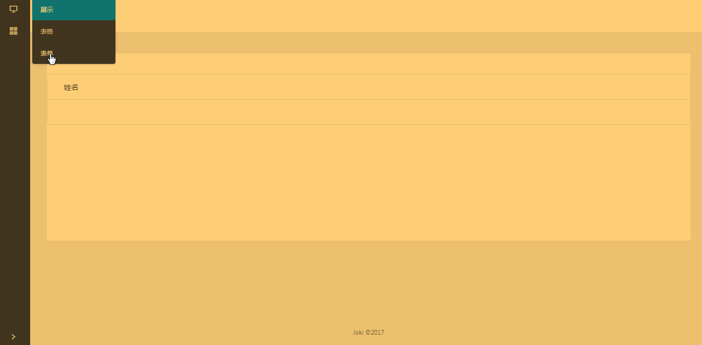

# Antd-Background

React + Ant Design 脚手架，用作后台管理系统，功能齐全，细节完善，可以直接上手和开发。

## 技术选型

* react + redux + react-router + ant-design
* redux-logger
* webpack

## 实现的功能

1. 热加载
2. ES6
3. 动态路由
4. action日志打印
5. 参数传递
6. 数据状态管理

